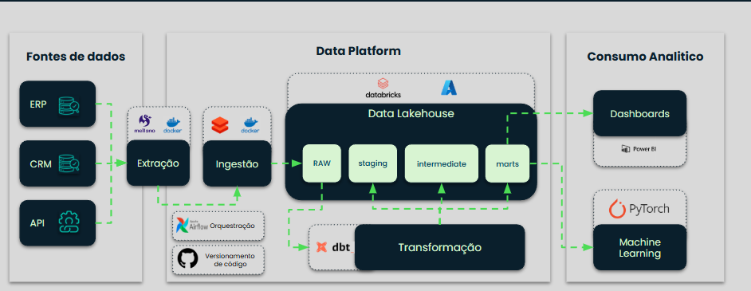
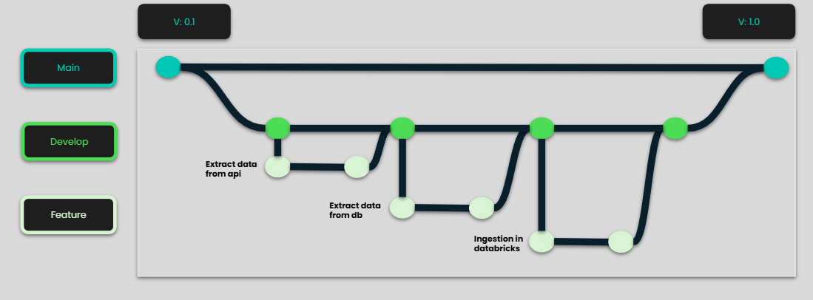

# [LH20253] Checkpoint 2: Adventure Works - Infraestrutura e Ingestão

Este projeto consiste na construção de um pipeline de dados para extração de dados da **Adventure Works** de um banco de dados SQL Server e uma API Rest e o processo de ingestão no **Databricks** em tabelas Delta.

No projeto é contem a conteinerização com **Docker**, extração com **Meltano**, ingestão com **Databricks CLI** e transformação via workflow no **Databricks**.

**Pré-requisitos:**

- Ter uma chave SSH configurada no GitHub
- Ter o Git instalado em sua máquina
- Ter o Docker instalado em sua máquina.
- Acesso ao Databricks
- Acesso ao banco de dados da Adventure Works
- Acesso à API da Adventure Works

**Estrutura de pastas**

aw-checkpoint2/
├── .env.example                    # Exemplo de variáveis de ambiente
├── .gitignore                      # Arquivos ignorados pelo Git
├── README.md                       # Documentação do projeto
├── docker-compose.yml              # Pipeline de execuçao de extração e ingestão com o Docker Compose
├── meltano.yml                     # Configurações do Meltano para extração
├── plugins/                        # Plugins Meltano
│    ├── extractors/                # Configurações da tap
│    └──  loaders/                  # Configurações dos targets
├── Notebook/                       # Notebooks do Databricks
│   └── convert_parquet_to_delta.ipynb
├── output/                         # Dados extraídos (Parquet)
└── schemas/                        # Schemas de extração Meltano API
    ├── purchaseorderdetail.json
    ├── purchaseorderheader.json
    ├── salesorderdetail.json
    └── salesorderheader.json

## Arquitetura Geral do Projeto




## Execução geral do projeto

### 1. Instalação e Requisitos

Clone o repositório
```bash
git clone git@github.com:AurelioSilvaLH/aw-checkpoint2.git
```

### 2. Configurar variáveis de ambiente

Faça uma cópia do arquivo `.env.example` e renomeie para `.env`:

```bash
cp .env.example .env
```
Em seguida edite o arquivo .env preenchendo com as credenciais necessárias para:
- Acesso ao banco de dados SQL Server
- Acesso à API 
- Configurações de acesso do Databricks CLI.

⚠️ Caso não possua um token do Databricks, gere um novo acessando: 

Menu superior direito no Databricks (seu usuário) →  Settings 
→ Developer → Access Tokens → Generate New Token


### 3. Configurações do Databricks
1. Edite o notebook `convert_parquet_to_delta.ipynb`, localizado na pasta **Notebook**, configurando os seguintes parâmetros com os nomes do seu ambiente no Databricks:

```Python
catalog_name = "nome_do_seu_catalog"
schema_name = "nome_do_seu_schema"
```

2 - Faça o upload do notebook no Databricks:

New → Notebook → File → Import → Drop file to upload, or browse

3 - Crie um job no Databricks para executar o notebook:

Job runs → Create job:
- `Task name` = Adicione um nome para a task
- `Type` = Notebook
- `Source` = Workspace
- `Path` = Selecione o notebook que foi importado

→ Clique em Create task

4 - Copie o Job ID criado na task e adicione-o no arquivo .env no campo:

```
DATABRICKS_JOB_ID=seu_job_id
```
5 - Crie uma pasta com nome **`raw`** dentro do seu schema no Databricks. Essa pasta será utilizada para armazenar os arquivos Parquet extraídos antes da conversão para Delta Table.

### 4. Executar o Pipeline
Com todas as configurações realizadas, execute o pipeline completo:

Esteja com o terminal apontado para a pasta aw-checkpoint2
```bash
 cd aw-checkpoint2
```
```bash
docker-compose up
```

**Este comando irá:**

1 - Baixar as imagens Docker necessárias
2 - Construir os containers necessários
3 - Executar o Meltano para extrair dados do banco de dados SQL Server e API
4 - Salvar os dados em formato Parquet na pasta output/
5 - Fazer upload dos arquivos para o Databricks com CLI
6 - Executar o job do Databricks para converter para Delta Tables

## Para futuros desenvolvimentos

* Crie uma branch para sua feature (git checkout -b feature/nova-feature)
* Commit suas mudanças (git commit -m 'Adiciona nova feature')
* Push para a branch (git push origin feature/nova-feature)
* Abra um Pull Request

## Gitflow

