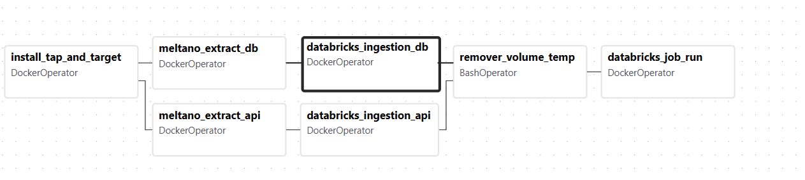
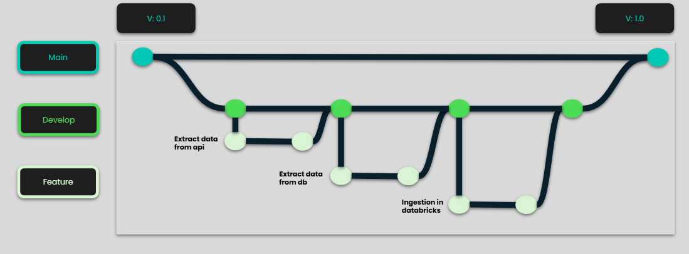
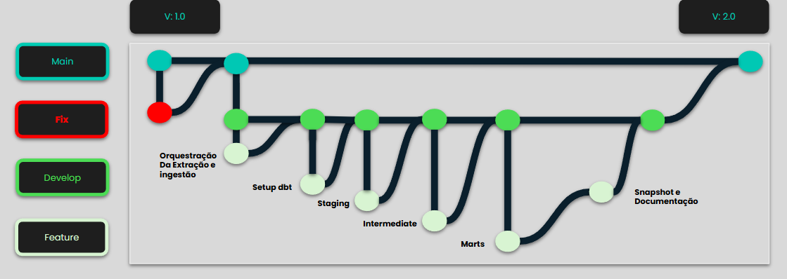

# [LH20253] Adventure Works

Este projeto consiste na construção de uma infraestrutura moderna de dados da **Adventure Works** contendo o processo de extração dos dados de um banco de dados SQL Server e uma API Rest usando o **Meltano**, o processo de ingestão no **Databricks** em tabelas Delta com **Databricks CLI**, transformação dos dados usando **dbt** todo o processo deve ser orquestrado com o **airflow** (em construção, atualmente somente a extração e ingestão estão orquestradas).

## Previsão de Demanda
A previsão de demanda foi incluida, contendo todo o desenvolvimento no notebook `Forecasting_Adventure_Works.ipynb`.

Para execução é necessário executar todo o passo a passo abaixo listado no README, onde incluirá a toda orquestração e transformação dos dados até a camada marts no Databricks.

Os requisitos de execução do Notebook estão listados no requirements.txt, a solução atual não necessita do uso de GPU.

A documentação do dbt está disponível no seguinte link: [Documentação dbt](https://687c96d669f98dfac1922f28--merry-starship-171e7c.netlify.app/)

**Pré-requisitos:**

- Ter uma chave SSH configurada no GitHub
- Ter o Git instalado em sua máquina
- Ter o Docker instalado em sua máquina.
- Acesso ao Databricks
- Acesso ao banco de dados da Adventure Works
- Acesso à API da Adventure Works
- Python 3.10

**Estrutura de pastas**

```shell
aw-checkpoint2/

└── config/                           # Pasta de configurações gerais do Airflow 
    └──  airflow.cfg                  # Arquivo de configuração Airflow
├── dags/                             # Pasta contendo as Dags para a orquestração usando o Airflow
    ├── utils/                        # Funções customizadas para a orquestração
        └── general_helpers.py        # Arquivo .py contendo as funções customizadas 
    └── dag_extract_raw_data.py       # Arquivo .py contendo a Dag de extração e ingestão
├── dbt/                              # Pasta contendo o projeto dbt para transformações dos dados
    ├── aw_project_dbt/               # Projeto dbt
        ├── analyses/        
        ├── docs-dbt/                 # Arquivos para gerar a documentação do dbt
        ├── logs/                     # Pasta de logs do dbt interna
        └── macros/                   # Pasta contendo as macros
            ├── custom_schema.sql          # Macro para customizar o nome da tabela gerada no DW
            ├── not_negative_values.sql    # Macro contendo o test referente a valores negativos
            └── test_due_date_after_order_date.sql  # Macro contendo o test referente a datas invalidas
        ├── models/                   # Modelos de transformações dbt
            ├── 1_staging/            # Pasta com os arquivos de transformações referente a camada staging
            ├── 2_intermediate/       # Pasta com os arquivos de transformações referente a camada intermediate
            └── 3_marts/              # Pasta com os arquivos de transformações referente a camada marts
        ├── seeds/
        ├── snapshots/                # Pasta com os arquivos necessários para a Snapshot
            └── snp_status_sales.sql  # Snapshot de atualização de status de pedido
        ├── tests/
        ├── .env-example-dbt          # Arquivo de exemplo de .env para o dbt
        ├── dbt_project.yml           # Arquivo de definição do projeto dbt
        ├── package-lock.yml          # Arquivo de definição de dependencias do dbt
        ├── packages.yml              # Arquivo de definição de dependencias do dbt
        └── profiles.yml              # Arquivo de definição das variáveis de ambiente do dbt
    └── logs/                         # Pasta de logs do dbt externa
├── imgs/                             # Imagens usadas no read.me
├── meltano/    
    ├── .env.example-meltano          # Exemplo das variáveis de ambiente utilizadas no Meltano
    ├── docker-compose.yml-legado     # Pipeline de extração e ingestão usando Docker Compose Checkpoint 2
    ├── meltano.yml                   # Arquivo de configuração do Meltano
    ├── plugins/                      # Diretório contendo os plugins do Meltano
        ├── extractors/               # Configurações das taps (fontes de dados)
        └── loaders/                  # Configurações dos targets (destinos dos dados)
    ├── output/                       # Arquivos Parquet gerados após a extração caso feita de forma manual
    └── catalogs/                     # Arquivos de discovery do Meltano
        ├── catalog_tap_mssql.json          
        └── catalog_tap_rest_api_msdk.json
    └── schemas/                      # Schemas utilizados para validar os dados da API
        ├── purchaseorderdetail.json
        ├── purchaseorderheader.json
        ├── salesorderdetail.json
        └── salesorderheader.json
├── Notebooks/                          # Notebooks utilizados no Databricks
    └── convert_parquet_to_delta.ipynb  # Notebook para conversão de Parquet em Delta Table
├── plugins/                            # Pasta para plugins do Airflow
├── .env.example-airflow                # Arquivo contendo um exemplo de arquivo .env para o airflow
├── docker-compose.yaml                 # Docker compose para o uso do Airflow
├── README.md                           # Documentação principal do projeto
└── requirements.txt                    # Arquivos de dependencias Python

```

## Arquitetura Geral do Projeto


## Execução geral do projeto

### 1. Instalação e Requisitos

Abra o  terminal de sua preferencia para executar os comandos abaixo
- Para construção do projeto utilizei o terminal `Git Bash` no Windows,
porem, não é uma dependencia, existe a possibilidade de que a execução de 
alguns codigos podem mudar dependendo do SO.

**Clone o repositório**
```bash
git clone git@github.com:AurelioSilvaLH/aw-checkpoint2.git
```

**Vá para a pasta do projeto**
```bash
cd aw-checkpoint2
```

**Crie e ative um ambiente virtual Python**

```bash
# crie a .venv
python -m venv .venv

# Windows
source .venv/Scripts/activate

# Linux
source .venv/bin/activate
```
**Instale as bibliotecas python necessárias**

```bash
pip install -r requirements.txt
```


### 2. Configurar variáveis de ambiente

⚠️ Existem **3** arquivos em que são necessários configurar as variáveis de ambiente.

* `.env.example-meltano`
* `.env.example-dbt`  
* `.env.example-airflow`  

É necessário fazer uma cópia dos arquivos `.env.example` e renomeie para `.env` dentro de suas respectivas pastas.

É possivel efetuar esse processo via terminal, porem é preciso cautela para garantir a criação correta dos arquivos

```bash
# .env airflow
cp .env.example-airflow .env

# .env meltano
cd meltano
cp .env.example-meltano .env

# Retornar para a pasta principal
cd ..

# .env dbt
cd dbt
cd aw_project_dbt
cp .env.example-dbt .env
```

Em seguida edite todos os arquivos .env criados preenchendo com 
as credenciais necessárias para:
- Acesso ao banco de dados SQL Server
- Acesso à API 
- Configurações de acesso do Databricks CLI.
- MELTANO_PROJECT_HOST_PATH: Caminho completo para a pasta do Meltano do projeto
- Para obter o AIRFLOW_UID=uid você pode executar o comando após iniciar o Airflow.

```bash
 echo -e "AIRFLOW_UID=$(id -u)" 
```
⚠️ Caso não possua um token do Databricks, gere um novo acessando: 

Menu superior direito no Databricks (seu usuário) →  Settings 
→ Developer → Access Tokens → Generate New Token


### 3. Configurações do Databricks
1. Edite o notebook `convert_parquet_to_delta.ipynb`, localizado na pasta **Notebook**, configurando os seguintes parâmetros com os nomes do seu ambiente no Databricks:

```Python
catalog_name = "nome_do_seu_catalog"
schema_name = "nome_do_seu_schema"
```

2 - Faça o upload do notebook no Databricks:

New → Notebook → File → Import → Drop file to upload, or browse

3 - Crie um job no Databricks para executar o notebook:

Job runs → Create job:
- `Task name` = Adicione um nome para a task
- `Type` = Notebook
- `Source` = Workspace
- `Path` = Selecione o notebook que foi importado

→ Clique em Create task

4 - Copie o Job ID criado na task e adicione-o no arquivo .env do Airflow no campo:

```
DATABRICKS_JOB_ID=seu_job_id
```
5 - Crie uma pasta com nome **`raw`** dentro do seu schema no Databricks. Essa pasta será utilizada para armazenar os arquivos Parquet extraídos antes da conversão para Delta Table.

### 4. Iniciar o Airflow

Esteja com o terminal apontado para a pasta **aw-checkpoint2**

```bash
 cd aw-checkpoint2
```
Com todas as configurações realizadas, execute o pipeline de extração:
```bash
# Inicie o Airflow
docker compose up airflow-init

# Suba os Airflow para o localhost
docker-compose up -d
```

**Estes comando irá:**

1 - Baixar as imagens Docker necessárias
2 - Construir os containers necessários
3 - Executar as instações necessárias para o Airflow

Acesse o Airflow em seu localhost: http://localhost:8080/
O usuário e senha padrão são "airflow" "airflow"

### 5. Dags

A DAG: `Extract_raw_data_to_databricks` esta com um agendamento diário para as 00:00 UTC
Porem é possivel executa-la apertando no botão `TRIGGER`



### 6. Transformações com o dbt

Para executar o projeto dbt seguir os seguintes comandos.

Esteja com o terminal apontado para a pasta **aw_project_dbt**

```bash
# Pasta dbt
 cd dbt

# Pasta aw_project_dbt
 cd aw_project_dbt
```

Inclua as variáveis de ambiente.

```bash
export $(cat .env | xargs)
```
Verifique se as configurações de acesso estão devidamente configuradas no .env respectivo do dbt

```bash
 dbt debug
```

Instale as dependencias do dbt (packages)
```bash
# Instale as dependencias
dbt deps
```

Execute os modelos
```bash
# Executar todos os modelos
dbt run

# Executar um modelo especifico
dbt run -s nome_do_modelo
```
Execute os testes configurados
```bash
dbt test
```
A documentação do dbt está disponível no seguinte link: [Documentação dbt](https://687c96d669f98dfac1922f28--merry-starship-171e7c.netlify.app/)


## Para futuros desenvolvimentos

* Crie uma branch para sua feature (git checkout -b feature/nova-feature)
* Commit suas mudanças (git commit -m 'Adiciona nova feature')
* Push para a branch (git push origin feature/nova-feature)
* Abra um Pull Request

## Gitflow V1 (Checkpoint 2) - Extração e Ingestão



## Gitflow V1 (Checkpoint 3) - Orquestração e Modelagem

